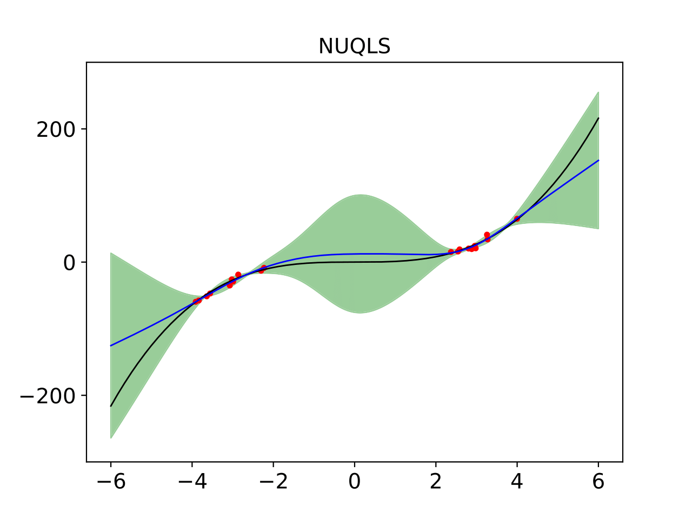

CUQLS: **C**onjugate **U**ncertainty **Q**uantification through **L**inearized **S**ampling
---
While neural networks have incredible predictive power, they lack a measure of their uncertainty. We require uncertainty so that we can answer the question: *when can we trust the output of a neural network?* 

We present CUQLS, a lightweight, scalable, post-hoc method for quantifying the uncertainty in the prediction of neural networks. 

### Installation
---
To install this package:
```
pip install git+https://github.com/josephwilsonmaths/cuqls-package.git
```
### Regression
---
We provide a simple example for how to use NUQLS. First load a toy dataset:
```
import torch
import matplotlib.pyplot as plt
import numpy as np
from torch.utils.data import DataLoader, Dataset
from regressionutil import mlp,train,plot_bayes_method,toy_dataset

train_x,train_y,test_x,test_y = toy_dataset(n_train=20, n_test=10000, std=3)

## plot train
plt.plot(train_x,train_y,'ro',markersize=5,label='train')
plt.plot(test_x,test_y,label='test')
plt.legend()
plt.show()

```

<p align='center'>
  
</p>


A single-layer MLP is then trained on the data:

```
class toy_dataset(Dataset):
    def __init__(self,x,y):
        self.x = x
        self.y = y

    def __len__(self):
        return self.x.shape[0]

    def __getitem__(self, i):
        return self.x[i], self.y[i]
    
toy_train_loader = DataLoader(toy_dataset(train_x,train_y),n_train)
toy_test_loader = DataLoader(toy_dataset(test_x,test_y),n_test)

## Set up neural network.
map_net = mlp(width=50)

map_epochs = 10000; map_lr = 0.001
mse_loss = torch.nn.MSELoss()
optimizer_MSE = torch.optim.Adam(map_net.parameters(), lr = map_lr, weight_decay=0)
scheduler_MSE = torch.optim.lr_scheduler.PolynomialLR(optimizer_MSE, map_epochs, 0.5)

for t in range(map_epochs):
    train_loss = train(train_x, train_y, map_net, mse_loss, optimizer_MSE, scheduler_MSE)

## plot train
plt.plot(train_x,train_y,'ro',markersize=5,label='train')
plt.plot(test_x,test_y,'k',label='test')
plt.plot(test_x, map_net(test_x).detach(), 'b', label='net')
plt.legend()
plt.show()
plt.savefig('plotfitted.pdf',format='pdf')
```

<p align='center'>
  
</p>

We can then apply NUQLS to obtain the uncertainty in the network. Either use Stochastic Gradient Descent (set `full_dataset=False`):
```
from nuqls.posterior import Nuqls

train_data = toy_dataset(train_x,train_y)
test_data = toy_dataset(test_x,test_y)

nuqls_posterior = Nuqls(map_net, task='regression', full_dataset=False)
res = nuqls_posterior.train(train=train_data, 
                      train_bs=20, 
                      scale=5, 
                      S=10, 
                      epochs=1000, 
                      lr=1e-4, 
                      mu=0.9, 
                      verbose=True)
nuql_test_preds = nuqls_posterior.test(test_data, test_bs=50)

nuql_mu = nuql_test_preds.mean(1)
nuql_var = nuql_test_preds.var(1)
```
Or use Gradient Descent (set `full_dataset=False`)(only for small datasets):
```
from nuqls.posterior import Nuqls

train_data = toy_dataset(train_x,train_y)
test_data = toy_dataset(test_x,test_y)

nuqls_posterior = Nuqls(map_net, task='regression', full_dataset=True)
res = nuqls_posterior.train(train=train_data,
                      scale=5, 
                      S=10, 
                      epochs=1000, 
                      lr=1e-4, 
                      mu=0.9, 
                      verbose=True)
nuql_test_preds = nuqls_posterior.test(test_data, test_bs=10)

nuql_mu = nuql_test_preds.mean(1)
nuql_var = nuql_test_preds.var(1)
```

The NUQLS variance term can then be used to create confidence intervals around the prediction:
```
fs, ms, lw = 14, 3, 1
f, (ax1) = plt.subplots(1,1)

## Plot NUQLs
plot_bayes_method(ax1,nuql_mu,nuql_var,
                  train_x,train_y,test_x,test_y,
                  'NUQLS',fs=fs, ms=ms, lw=lw)

plt.show()
plt.savefig('plotvariance.pdf',format='pdf')
```

<p align='center'>
  
</p>

### Classification
---
We take a ResNet50, pre-trained on SVHN:
```
import torch
import torchvision.transforms as transforms
from torchvision import datasets
from classificationutils.resnet import ResNet50

torch.set_default_dtype(torch.float64)

device = (
    "cuda"
    if torch.cuda.is_available()
    else "mps"
    if torch.backends.mps.is_available()
    else "cpu"
)
print(f"\n Using {device} device")
print(f"CUDA version: {torch.version.cuda}")

transform_train = transforms.Compose([
    transforms.RandomCrop(32, padding=4),
    transforms.RandomHorizontalFlip(),
    transforms.ToTensor(),
    transforms.Normalize((0.4376821, 0.4437697, 0.47280442), (0.19803012, 0.20101562, 0.19703614)),
])

transform_test = transforms.Compose([
    transforms.ToTensor(),
    transforms.Normalize((0.4376821, 0.4437697, 0.47280442), (0.19803012, 0.20101562, 0.19703614)),
])

training_data = datasets.SVHN(
    root="examples/data/SVHN",
    split='train',
    download=True,
    transform=transform_train
)

test_data = datasets.SVHN(
    root="examples/data/SVHN",
    split='test',
    download=True,
    transform=transform_test
)

transform_test_cifar = transforms.Compose([
    transforms.ToTensor(),
    transforms.Normalize((0.4914, 0.4822, 0.4465), (0.2023, 0.1994, 0.2010)),
])

ood_test_data = datasets.CIFAR10(
    root="examples/data/CIFAR10",
    train=False,
    download=True,
    transform=transform_test_cifar
) 

n_output = 10
n_channels = 3

net = ResNet50(in_channels=n_channels, num_classes = n_output)
net.load_state_dict(torch.load(f'classificationutils/resnet50_trained_svhn.pt', weights_only=True))
```

NUQLS can then be applied to find the uncertainty in the network:
```
from nuqls.posterior import Nuqls

nuqls_posterior = Nuqls(net, task='classification')
loss,acc = nuqls_posterior.train(train=training_data, 
                    train_bs=152, 
                    n_output=n_output,
                    S=10,
                    scale=0.0025, 
                    lr=1e-2, 
                    epochs=2, 
                    mu=0.9,
                    verbose=True,
                    extra_verbose=True)

id_logits = nuqls_posterior.test(test_data, test_bs=152) 
id_predictions = id_logits.softmax(dim=2)
id_variance = id_predictions.var(0)

ood_logits = nuqls_posterior.test(ood_test_data, test_bs=152)
ood_predictions = ood_logits.softmax(dim=2)
ood_variance = ood_predictions.var(0)
```

We can then look at the distribution of `id_variance` and `ood_variance`, by looking at a violin plot of the variances. We also sort the `id_variance` terms into those the network got correct, and those it got incorrect:
```
nuqls_variance = classificationutils.metrics.sort_probabilies(id_predictions.to('cpu'), ood_predictions.to('cpu'), test_data=test_data)

classificationutils.metrics.plot_vmsp(prob_dict=nuqls_variance,
                          title=f'SVHN ResNet50',
                          save_fig=f"examples/images/vmsp_plot.pdf")
```

<p align='center'>
  
</p>

We have compared to a 'BASE' method, where we randomly sample many realizations of `10` logits from the standard normal distribution, and compute the variance of these predictions. We want large variance for OoD and incorrectly predicted ID points, and very low variance for correctly predicted ID points. We see that NUQLS does very well at this task!

License
-------

This is free and unencumbered software released into the public domain.

Anyone is free to copy, modify, publish, use, compile, sell, or
distribute this software, either in source code form or as a compiled
binary, for any purpose, commercial or non-commercial, and by any means.
